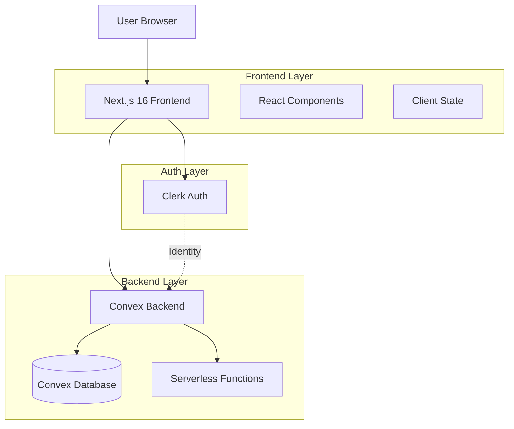
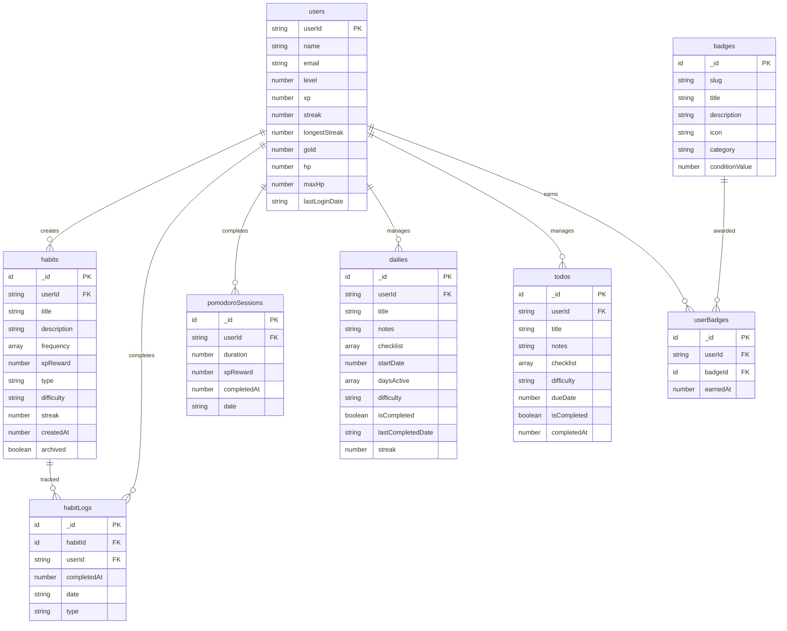
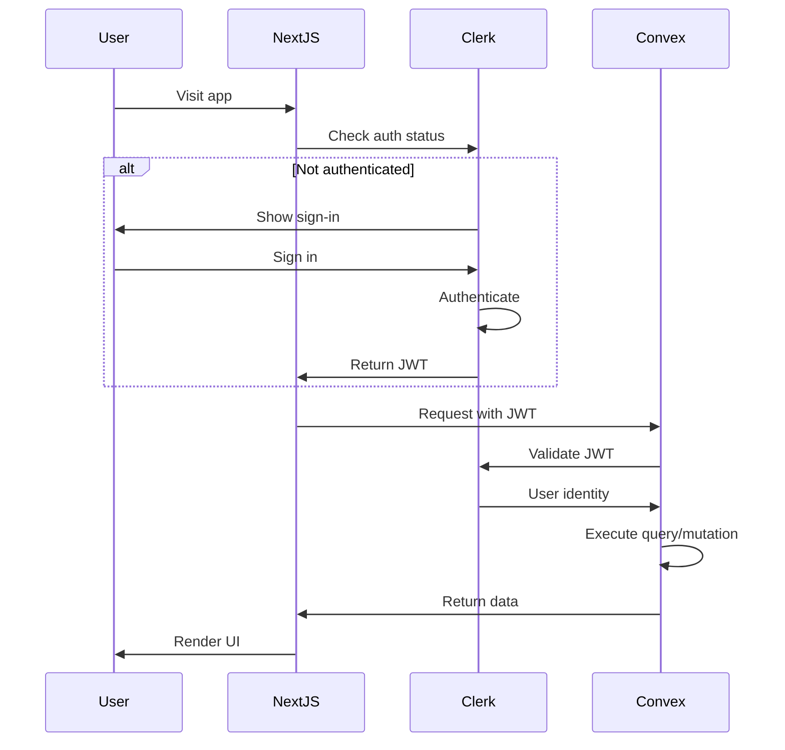
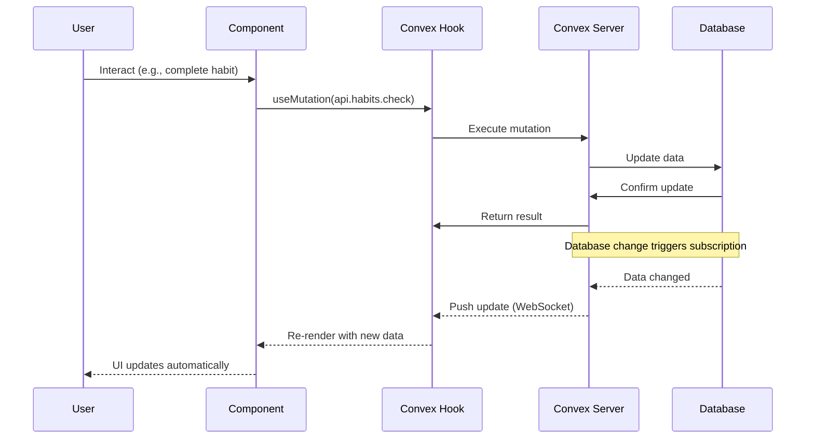
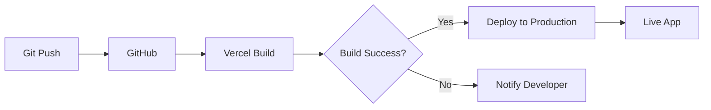

# Architecture Documentation

## System Overview

Gamified Habit Tracker is a full-stack web application built with modern technologies, featuring real-time data synchronization, authentication, and a gamification engine.

## High-Level Architecture



## Technology Stack

### Frontend
- **Framework**: Next.js 16 (App Router)
- **Build Tool**: Turbopack
- **Language**: TypeScript 5
- **Styling**: TailwindCSS 4
- **State Management**: Convex React hooks + React built-in state
- **UI Components**: Custom components with Radix UI primitives
- **Icons**: Lucide React
- **Animations**: Canvas Confetti

### Backend
- **Database**: Convex (NoSQL, real-time)
- **Functions**: Convex serverless functions (mutations & queries)
- **Authentication**: Clerk (integrated with Convex)
- **Real-time**: Convex WebSocket subscriptions

### Deployment
- **Frontend**: Vercel
- **Backend**: Convex Cloud
- **Domain**: Custom domain via Vercel

## Database Schema

### Entity Relationship Diagram



### Indexes

- **users**: `by_userId` (userId)
- **habits**: `by_user` (userId)
- **habitLogs**: `by_user_date` (userId, date), `by_habit` (habitId)
- **pomodoroSessions**: `by_user` (userId), `by_user_date` (userId, date)
- **badges**: `by_slug` (slug)
- **userBadges**: `by_user` (userId), `by_user_badge` (userId, badgeId)
- **dailies**: `by_user` (userId)
- **todos**: `by_user` (userId)

## Authentication Flow



## Component Architecture

### Directory Structure

```
app/
├── components/
│   ├── features/          # Feature

-specific components
│   │   ├── habits/        # Habit tracking
│   │   │   ├── HabitList.tsx
│   │   │   ├── CreateHabitForm.tsx
│   │   │   └── index.ts
│   │   ├── pomodoro/      # Pomodoro timer
│   │   ├── gamification/  # Badges, level-up
│   │   ├── dailies/       # Daily tasks
│   │   ├── todos/         # Todo management
│   │   └── rewards/       # Reward shop
│   ├── layout/            # Layout components
│   │   ├── Sidebar.tsx
│   │   ├── MobileHeader.tsx
│   │   └── MobileNav.tsx
│   ├── ui/                # Reusable UI components
│   │   ├── button.tsx
│   │   └── ...
│   └── providers/         # Context providers
│       └── ConvexClientProvider.tsx
```

### Component Patterns

1. **Feature Components**: Self-contained features with their own state
2. **Layout Components**: Responsible for app structure and navigation
3. **UI Components**: Reusable, generic components (buttons, inputs, etc.)
4. **Providers**: Context and third-party integrations

## Data Flow

### Real-Time Updates



### State Management Strategy

- **Server State**: Managed by Convex (queries/mutations)
  - User data, habits, sessions, badges
  - Real-time synchronization via WebSocket
  - Automatic caching and optimistic updates

- **Client State**: React useState/useRef
  - UI state (modals, forms, timers)
  - Temporary input values
  - Animation states

## Gamification Engine

### XP & Leveling System

```typescript
// XP Calculation
const DIFFICULTY_REWARDS = {
  trivial: { xp: 5, gold: 0.5, damage: 2 },
  easy: { xp: 10, gold: 1, damage: 5 },
  medium: { xp: 20, gold: 2.5, damage: 10 },
  hard: { xp: 40, gold: 5, damage: 20 }
};

// Level Calculation
const newLevel = Math.floor(xp / 1000) + 1;
```

### Badge Award System

Badges are automatically awarded when conditions are met:

```typescript
// Example: Award badge on habit milestone
if (totalHabitLogs.length === 1) {
  await ctx.runMutation(api.badges.awardBadge, { slug: "first-step" });
}
```

### Streak Tracking

```typescript
// Streak logic
const today = new Date().toISOString().split("T")[0];
const yesterday = new Date(Date.now() - 86400000).toISOString().split("T")[0];

if (lastLoginDate === yesterday) {
  streak += 1; // Continue streak
} else if (lastLoginDate !== today) {
  streak = 1; // Reset streak
}
```

## API Design

### Convex Functions

#### Queries (Read Operations)
```typescript
export const get = query({
  args: {},
  handler: async (ctx) => {
    const identity = await ctx.auth.getUserIdentity();
    return await ctx.db.query("habits")
      .withIndex("by_user", (q) => q.eq("userId", identity.subject))
      .collect();
  }
});
```

#### Mutations (Write Operations)
```typescript
export const check = mutation({
  args: { habitId: v.id("habits"), date: v.string() },
  handler: async (ctx, args) => {
    const identity = await ctx.auth.getUserIdentity();
    // Validation, business logic, database updates
    await ctx.db.insert("habitLogs", { ... });
    // Award XP, check badges, etc.
  }
});
```

## Performance Optimizations

1. **Real-time Subscriptions**: Only for data that changes frequently
2. **Indexed Queries**: All queries use proper indexes
3. **Server-Side Rendering**: Static generation where possible
4. **Code Splitting**: Automatic route-based splitting
5. **Image Optimization**: Next.js Image component
6. **Turbopack**: Fast builds and HMR

## Security

- **Authentication**: Clerk JWT validation on all requests
- **Authorization**: User ID validation in all mutations/queries
- **Input Validation**: Type safety with Convex validators
- **Environment Variables**: Secure credential storage
- **HTTPS**: Enforced in production

## Deployment Strategy

### Continuous Deployment



### Environment Configuration

- **Development**: Local with Convex dev deployment
- **Production**: Vercel + Convex production deployment
- **Environment Variables**: Managed separately per environment

## Future Architecture Considerations

### Sprint 4: Analytics
- Consider client-side charting libraries (Recharts)
- Aggregate queries for performance
- Date range filtering utilities

### Sprint 5: Polish
- Add service worker for offline support
- Implement caching strategies
- Add error boundary components

### Scalability
- Current architecture supports thousands of users
- Convex auto-scales backend
- Consider CDN for static assets

## Monitoring & Debugging

- **Convex Dashboard**: Real-time function logs and database inspector
- **Vercel Analytics**: Performance and traffic metrics
- **Browser DevTools**: React DevTools, Network tab
- **Console Logs**: Strategic logging for debugging

---

Last Updated: December 2025
